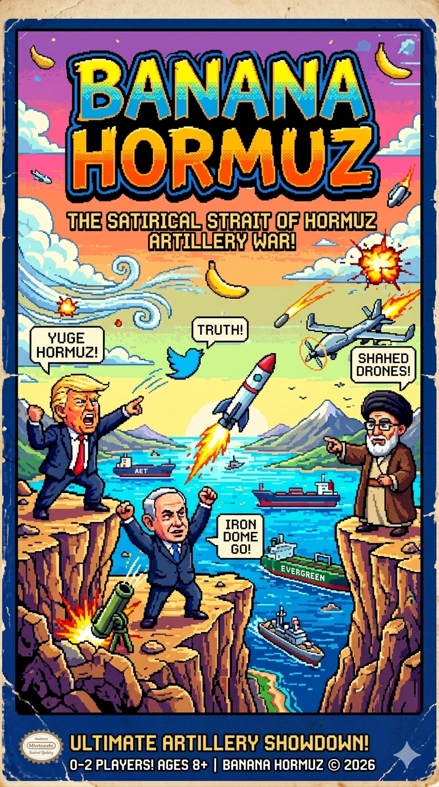

# Banana Hormuz

A pixel-bit artillery game set on the cliffs across
the **Strait of Hormuz**. Take turns lobbing your signature projectile at your opponent,
fighting gravity and wind.

It's a satirical game. The fighters are caricatures:

| Fighter | Weapon |
|---------|--------|
| **Donald** (Trump) | 📱 Truth Social post |
| **Bibi** (Netanyahu) | 🚀 Patriot missile |
| **Khamenei** (Mojtaba Khamenei) | 🛩️ Shahed drone |

## Play

- **1 Player** vs an adaptive AI (Easy / Normal / Hard), or **2 Players** on one keyboard.
- Pick your fighter, set **ANGLE** (0–90°) and **POWER** (0–100), watch the **WIND**, and **FIRE!**
- First to **3 round wins** takes the match. Win in fewer shots for a higher score.
- High scores are saved in your browser, keyed by player name.

**Controls:** sliders + Fire button, or keyboard — `←`/`→` angle, `↑`/`↓` power, `Space`/`Enter` to fire.

## Play online

https://pi3ch.github.io/banana-hormuz/

## Play locally

1. Clone or download this repo
2. double-click `index.html` (or open it in any browser).

No server or dependencies.

## License

[MIT](LICENSE) © 2026 pi3ch — free to use, modify, and distribute; just keep the
copyright notice. It's a satirical parody work; all caricatures are for satire/parody.
